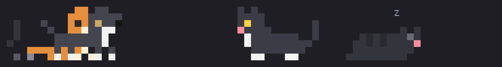

# claude-code-mods

Two little mods for the [Claude Code](https://code.claude.com) terminal, by VkaZas. Each one draws in the band above the prompt, and they stack: install both and the parade walks above the combo.

| | Mod | What it does |
| --- | --- | --- |
|  | [**Pixel Parade**](pixel-parade) | Hand-drawn pixel-art cats and dogs wander above the prompt: they stroll, nap, zoom, share hearts and chase each other. Choose how many, and cats, dogs or both. |
|  | [**Typing Combo**](typing-combo) | A fighting-game combo counter: big digits that take a hit on every keystroke, harder the faster you type, with hit-stop, ranks, keys per second and your best. |

## Install

At the prompt of a Claude Code terminal session:

```
/plugin install pixel-parade --marketplace VkaZas/claude-code-mods
/plugin install typing-combo --marketplace VkaZas/claude-code-mods
```

The first one asks to add the marketplace (`y`), then for a scope. From your shell instead (Claude Code 2.1.292 or later), use `claude plugin install <mod> --marketplace VkaZas/claude-code-mods`. To take a newer version later: `claude plugin update <mod>@vkazas`.

Both were built and tested with Claude Code 2.1.295. Neither reads your files or talks to the network.

## 中文

两个 Claude Code 终端小 mod：**Pixel Parade**（提示框上方的像素猫狗巡游）和 **Typing Combo**（打字连击）。安装命令同上，在 `/config` 里把 Language 设成 `zh` 就是中文提示。

## License

[MIT](LICENSE)
